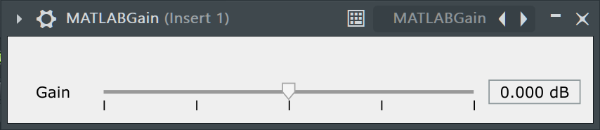

<!--
 _class: title
 -->
# MATLAB で Audio Plugin 開発
## #01 ゲイン (＋プラグインの作りの基礎)
松本 和樹 (早稲田大学，MATLAB Student Ambassador)

---
<!--
 _class: title
 -->
# 
# はじめに

---

# 自己紹介

<div style="display: flex; align-items: center; align-items: flex-start;">

<div style="flex: 2;padding-right: 200px"> 


<div class="figure-caption"> 

</div>

</div> 

<div style="flex: 5;">

**氏名**　：松本 和樹
**研究**　：音響信号処理
**趣味**　：作曲
**仕事**　：**MATLAB Student Ambassador**
　　　　[@km_MATLAB_Amb](https://twitter.com/km_MATLAB_Amb)
</div>
</div> 

---

# MATLAB とは

<div style="display: flex; align-items: center; align-items: flex-start;">

<div style="flex: 2;padding-right: 200px;"> 


> https://jp.mathworks.com/products/matlab.html

<div class="figure-caption"> 

</div>

</div> 

<div style="flex: 5;">

MathWorks 社の**数値解析ソフトウェア**

- プログラミング言語 
- データの処理や可視化が簡単

<br>

様々な [Toolbox](https://jp.mathworks.com/products.html) が研究開発を支援
- 信号処理
- 機械学習

</div>
</div> 


---

# Campus-Wide License と Student Ambassador

<div style="display: flex; align-items: center; align-items: flex-start;">

<div style="flex: 2;padding-right: 200px"> 


<div class="figure-caption"> 

</div>

</div> 

<div style="flex: 5;">

## MATLAB を無料で使えるライセンス
- 大学などの教育機関が MathWorks と提携
- MATLAB 本体だけでなく，Toolbox も無料
- 使わないともったいない！

<div style="padding:30px"></div>

## MATLAB Student Ambassador

 Campus-Wide License を導入する大学で
**MATLAB の利用を促進**するために活動する学生

- **MATLAB 講習会**の開催
- 質問への対応
- X：[@km_MATLAB_Amb](https://twitter.com/km_MATLAB_Amb)
</div>
</div> 


---
# MATLAB で Audio Plugin 開発

## Audio Plugin とは
- DAW 等の**音楽制作ソフトウェア**上で動作する拡張機能
- MATLAB の [Audio Toolbox](https://jp.mathworks.com/products/audio.html) で手軽な開発が可能


## シリーズの内容
- [第1回：ゲイン (＋プラグインの作りの基礎)](AudioPlugin_01_Gain.html)
- [第2回：イコライザ](AudioPlugin_02_EQ.html)
- [第3回：ディストーション](AudioPlugin_03_Distortion.html)

プログラムは：https://github.com/kzkmtmt/audioPlugins からダウンロード

---

# MATLAB で Audio Plugin 開発

## こんな人におすすめ

- 自作の Audio Plugin を作ってみたい / MATLAB で信号処理をしてみたい


## 必要なもの

- MATLAB 2024b 

- Toolbox（Signal Processing Toolbox, DSP System Toolbox, Audio Toolbox）
    MATLAB をインストール済みの場合：[ホーム > アドオン](https://jp.mathworks.com/products/matlab/add-on-explorer.html)から追加できる

- [C/C++ コンパイラ](https://jp.mathworks.com/support/requirements/supported-compilers.html)（Audio Toolbox	をカバーするもの）

    - Windowsの場合：[Microsoft Visual C++ 2022](https://visualstudio.microsoft.com/ja/vs/) など
    ※ インストール時に[Desktop development with C++](https://jp.mathworks.com/matlabcentral/answers/443349-how-do-i-install-visual-studio-for-use-with-matlab-simulink) を選択してください

- VSTプラグインを読み込める DAW（[REAPER](https://www.REAPER.fm/)など）

---
<!--
 _class: title
 -->
# 
# Audio Plugin 開発の流れ
------

# Audio Plugin 開発の流れ
1. アルゴリズムの開発
1. プラグインの実装
    - `audioPlugin`クラスを継承
    - `process`メソッド内にアルゴリズムを実装
    - `pluginInterface`で操作画面を実装
1. `audioTestBench`を用いたテスト
1. `validateAudioPlugin`を用いた検証
1. `generateAudioPlugin`を用いた VST プラグイン生成
1. DAW 上で動作確認

---
<!--
 _class: title
 -->
# 
# ゲインの実装

---

# Audio Plugin 開発の流れ
1. **アルゴリズムの開発**📝
2. プラグインの実装
    - `audioPlugin`クラスを継承
    - `process`メソッド内にアルゴリズムを実装
    - `pluginInterface`で操作画面を実装
3. `audioTestBench`を用いたテスト
4. `validateAudioPlugin`を用いた検証
5. `generateAudioPlugin`を用いた VST プラグイン生成
6. DAW 上で動作確認


---

# ゲインのアルゴリズム

<div style="display: flex; align-items: center; align-items: flex-start;">

<div style="flex: 1"> 

<div style="flex:1; width= 100 %;">



</div>

</div> 

<div style="flex: 2;padding-left: 100px">


- **ゲイン**：音量を変化させるプラグイン
- 入力 $x(t)$ に係数 $a$ を掛けて出力（$t$ は時刻） 
$$
y(t) = a x(t)
$$
- $a$ が大きければ音は大きく，小さければ小さくなる
- $a$ の値はデシベル単位のゲイン $g$ から計算
$$
\begin{aligned}
g = 20\log_{10}a \quad \Rightarrow \quad & a = 10^{g/20}
\end{aligned}$$


- プログラムは以下の通り（6 dB で $a=1.99\approx 2$）
    ```MATLAB
    x = [1;2;3];   % 入力信号の例
    g = 6;         % ゲイン [dB]
    a = 10^(g/20); % デシベル値から係数を計算．a = db2mag(g) でも良い
    y = a * x;     % 入力 x に定数 a を掛けて出力
    ```

</div>
</div> 

---

# Audio Plugin 開発の流れ
1. **アルゴリズムの開発**📝
2. プラグインの実装
    - `audioPlugin`クラスを継承
    - `process`メソッド内にアルゴリズムを実装
    - `pluginInterface`で操作画面を実装
3. `audioTestBench`を用いたテスト
4. `validateAudioPlugin`を用いた検証
5. `generateAudioPlugin`を用いた VST プラグイン生成
6. DAW 上で動作確認

---

# Audio Plugin 開発の流れ
1. アルゴリズムの開発✅
2. プラグインの実装
    - **`audioPlugin`クラスを継承**📝
    - `process`メソッド内にアルゴリズムを実装
    - `pluginInterface`で操作画面を実装
3. `audioTestBench`を用いたテスト
4. `validateAudioPlugin`を用いた検証
5. `generateAudioPlugin`を用いた VST プラグイン生成
6. DAW 上で動作確認


---

# プラグインのクラスを実装
`MATLAB_Gain.m`を作成


💡クラスや考え方・使い方は [オブジェクト指向プログラミング入門](https://matlabacademy.mathworks.com/jp/details/object-oriented-programming-onramp/oroop) などをチェック

---

# `audioPlugin` クラスの継承

<div style="display: flex; align-items: center; align-items: flex-start;">

<div style="flex: 1; margin-right: 100px"> 


```MATLAB
classdef クラス名 < audioPlugin 

properties 
    % プラグインが持つ変数を定義
end

methods
    % 信号を処理する関数
    function y = process(p,x) 
        y = x; % 入力をそのまま返す
    end
end
end
```

</div>

<div style="flex: 1.2;"> 

**クラス名**
- プラグインの名前
- ファイル名と同じ名前に設定

**properties**
- プラグイン `p` が持つ変数を定義する

**process メソッド**
- 入力信号 `x` から出力信号 `y` を計算する関数
- `p` はプラグイン自身を参照するためのもの

</div>

</div>

---

# Audio Plugin 開発の流れ
1. アルゴリズムの開発✅
2. プラグインの実装
    - **`audioPlugin`クラスを継承**📝
    - `process`メソッド内にアルゴリズムを実装
    - `pluginInterface`で操作画面を実装
3. `audioTestBench`を用いたテスト
4. `validateAudioPlugin`を用いた検証
5. `generateAudioPlugin`を用いた VST プラグイン生成
6. DAW 上で動作確認

---


# Audio Plugin 開発の流れ
1. アルゴリズムの開発✅
2. プラグインの実装
    - `audioPlugin`クラスを継承✅
    - **`process`メソッド内にアルゴリズムを実装**📝
    - `pluginInterface`で操作画面を実装
3. `audioTestBench`を用いたテスト
4. `validateAudioPlugin`を用いた検証
5. `generateAudioPlugin`を用いた VST プラグイン生成
6. DAW 上で動作確認


---


# `process`メソッド内にアルゴリズムを実装

<div style="display: flex; align-items: center; align-items: flex-start;">

<div style="flex: 1; margin-right: 100px"> 


```MATLAB
classdef MATLAB_Gain < audioPlugin 

properties 
    g = 0 % ゲイン [dB]
end

methods
    function y = process(p,x) 
        a = 10^(p.g/20); % g から a を計算
        y = a * x;       % x に a をかけて出力
    end
end
end
```

</div>

<div style="flex: 1.2;"> 

**クラス名**
- ファイル名に併せて `MATLAB_Gain` に変更
- 自分で名前を決めたい場合はファイル名も変更

**properties**
- 音量のパラメータ `g` を用意し 0 で初期化

**process メソッド**
- `p.g` の値を参照して係数 `a` を計算
- 入力 `x` に `a` をかけて出力

</div>

</div>

---


# Audio Plugin 開発の流れ
1. アルゴリズムの開発✅
2. プラグインの実装
    - `audioPlugin`クラスを継承✅
    - **`process`メソッド内にアルゴリズムを実装**📝
    - `pluginInterface`で操作画面を実装
3. `audioTestBench`を用いたテスト
4. `validateAudioPlugin`を用いた検証
5. `generateAudioPlugin`を用いた VST プラグイン生成
6. DAW 上で動作確認


---


# Audio Plugin 開発の流れ
1. アルゴリズムの開発✅
2. プラグインの実装
    - `audioPlugin`クラスを継承✅
    - `process`メソッド内にアルゴリズムを実装✅
    - **`pluginInterface`で操作画面を実装**📝
3. `audioTestBench`を用いたテスト
4. `validateAudioPlugin`を用いた検証
5. `generateAudioPlugin`を用いた VST プラグイン生成
6. DAW 上で動作確認


---


# `audioPluginInterface` で操作画面を定義

<div style="display: flex; align-items: flex-start;">

<div style="flex: 1; margin-right: 100px; align-items: center;"> 


```MATLAB
properties(Constant)
    PluginInterface = ...
        audioPluginInterface( ...
            audioPluginParameter(... 
                'g',...                      
                'DisplayName','Gain',...     
                'Mapping',{'lin',-60,20},... 
                'Label','dB'...              
            )...
    );
end
```


</div>

<div style="flex: 1.2;"> 

- プロパティに `PluginInterface` を追加
- 画面上で操作したいパラメータの数だけ `audioPluginParameter` を作成して
    `audioPluginInterface` に渡す

| 設定項目 | 値 |
| --- | --- |
| プロパティ | `'g'`|
| 表示名 |`Gain` |
| マッピング | 線形軸（`lin`）　　　範囲は -60 から 20 |
| ラベル | `'dB'`| 

💡[Design User Interface for Audio Plugin](https://www.mathworks.com/help/audio/ug/plugin-gui-design.html) 

</div>

</div>


---

# Audio Plugin 開発の流れ
1. アルゴリズムの開発✅
2. プラグインの実装
    - `audioPlugin`クラスを継承✅
    - `process`メソッド内にアルゴリズムを実装✅
    - **`pluginInterface`で操作画面を実装**📝
3. `audioTestBench`を用いたテスト
4. `validateAudioPlugin`を用いた検証
5. `generateAudioPlugin`を用いた VST プラグイン生成
6. DAW 上で動作確認

---

# Audio Plugin 開発の流れ
1. アルゴリズムの開発✅
2. プラグインの実装
    - `audioPlugin`クラスを継承✅
    - `process`メソッド内にアルゴリズムを実装✅
    - `pluginInterface`で操作画面を実装✅
3. **`audioTestBench`を用いたテスト**📝
4. `validateAudioPlugin`を用いた検証
5. `generateAudioPlugin`を用いた VST プラグイン生成
6. DAW 上で動作確認

---
# `audioTestBench` を用いたテスト
以下のコマンドで`audioTestBench`を起動 & パラメータを操作し，**音量の変化を確認**
```terminal
>> audioTestBench MATLAB_Gain
```

---

# Audio Plugin 開発の流れ
1. アルゴリズムの開発✅
2. プラグインの実装
    - `audioPlugin`クラスを継承✅
    - `process`メソッド内にアルゴリズムを実装✅
    - `pluginInterface`で操作画面を実装✅
3. **`audioTestBench`を用いたテスト**📝
4. `validateAudioPlugin`を用いた検証
5. `generateAudioPlugin`を用いた VST プラグイン生成
6. DAW 上で動作確認

---

# Audio Plugin 開発の流れ
1. アルゴリズムの開発✅
2. プラグインの実装
    - `audioPlugin`クラスを継承✅
    - `process`メソッド内にアルゴリズムを実装✅
    - `pluginInterface`で操作画面を実装✅
3. `audioTestBench`を用いたテスト✅
4. **`validateAudioPlugin`を用いた検証**📝
5. `generateAudioPlugin`を用いた VST プラグイン生成
6. DAW 上で動作確認


---
# `validateAudioPlugin` を用いた検証
`validateAudioPlugin`を用いてプラグインの動作を検証する

```terminal
>> validateAudioPlugin MATLAB_Gain

プラグインのクラスをチェック中 'MATLAB_Gain'... 合格.
テストベンチ ファイルの生成中 'testbench_MATLAB_Gain.m'... 完了.
テストベンチの実行中... 合格.
MEX ファイルの生成中 'testbench_MATLAB_Gain_mex.mexw64'... 完了.
MEX テストベンチの実行中... 合格.
テストベンチの削除中.
オーディオ プラグインを生成する準備ができました.
```

---

# Audio Plugin 開発の流れ
1. アルゴリズムの開発✅
2. プラグインの実装
    - `audioPlugin`クラスを継承✅
    - `process`メソッド内にアルゴリズムを実装✅
    - `pluginInterface`で操作画面を実装✅
3. `audioTestBench`を用いたテスト✅
4. **`validateAudioPlugin`を用いた検証**📝
5. `generateAudioPlugin`を用いた VST プラグイン生成
6. DAW 上で動作確認

---

# Audio Plugin 開発の流れ
1. アルゴリズムの開発✅
2. プラグインの実装
    - `audioPlugin`クラスを継承✅
    - `process`メソッド内にアルゴリズムを実装✅
    - `pluginInterface`で操作画面を実装✅
3. `audioTestBench`を用いたテスト✅
4. `validateAudioPlugin`を用いた検証✅
5. **`generateAudioPlugin`を用いた VST プラグイン生成**📝
6. DAW 上で動作確認


---
# `generateAudioPlugin`を用いた VST プラグイン生成
`generateAudioPlugin`を用いてプラグインを生成


- デフォルトではVST規格のDLLファイルが生成される

- オプションでAU規格のプラグインやEXEファイルも生成できる

    💡 詳しくは   [generateAudioPlugin](https://jp.mathworks.com/help/audio/ref/generateaudioplugin.html)を参照
```MATLAB
>> generateAudioPlugin MATLAB_Gain
```

---

# Audio Plugin 開発の流れ
1. アルゴリズムの開発✅
2. プラグインの実装
    - `audioPlugin`クラスを継承✅
    - `process`メソッド内にアルゴリズムを実装✅
    - `pluginInterface`で操作画面を実装✅
3. `audioTestBench`を用いたテスト✅
4. `validateAudioPlugin`を用いた検証✅
5. **`generateAudioPlugin`を用いた VST プラグイン生成**📝
6. DAW 上で動作確認

---

# Audio Plugin 開発の流れ
1. アルゴリズムの開発✅
2. プラグインの実装
    - `audioPlugin`クラスを継承✅
    - `process`メソッド内にアルゴリズムを実装✅
    - `pluginInterface`で操作画面を実装✅
3. `audioTestBench`を用いたテスト✅
4. `validateAudioPlugin`を用いた検証✅
5. `generateAudioPlugin`を用いた VST プラグイン生成✅
6. **DAW 上で動作確認**📝


---
## 6. DAW 上で動作確認
プラグインの生成が終わったら，DAW 上で動作を確認！
- 様々な DAW 上で動作確認するのが望ましい
- DAW ごとに VST Plugin の読み込み方法が異なる

   **REAPER の場合**：Option > Preferences > VST > Edit path list > add path で
    DLL ファイルの格納されたディレクトリを追加し Rescan ボタンを押す
> https://www.REAPER.fm/

---

# Audio Plugin 開発の流れ
1. アルゴリズムの開発✅
2. プラグインの実装
    - `audioPlugin`クラスを継承✅
    - `process`メソッド内にアルゴリズムを実装✅
    - `pluginInterface`で操作画面を実装✅
3. `audioTestBench`を用いたテスト✅
4. `validateAudioPlugin`を用いた検証✅
5. `generateAudioPlugin`を用いた VST プラグイン生成✅
6. DAW 上で動作確認✅

<div style="text-align: center; background-color:var(--light-background); margin-top:30px; padding-top:20px; padding-bottom:20px; margin-left:50px; margin-right:50px">

**VST プラグイン開発の一連の流れを確認 💯**
</div>

---
<!--
 _class: title
 -->

# おわりに
---

# まとめ

- ゲインの実装
- Audio Plugin 開発の流れ

# 役立つ資料

- [MATLAB 入門](https://matlabacademy.mathworks.com/jp/details/matlab-onramp/gettingstarted)：MATLAB の基本的な使い方
- [オブジェクト指向プログラミング入門](https://matlabacademy.mathworks.com/jp/details/object-oriented-programming-onramp/oroop)：オブジェクト指向プログラミング
- [Audio Plugin Example Gallery](https://jp.mathworks.com/help/audio/ug/audio-plugin-example-gallery.html)：Audio Plugin の MATLAB 実装例
- [Audio Plugin Creation and Hosting](https://jp.mathworks.com/help/audio/audio-plugin-creation-and-hosting.html?s_tid=CRUX_lftnav)：Audio Plugin 関連のドキュメント