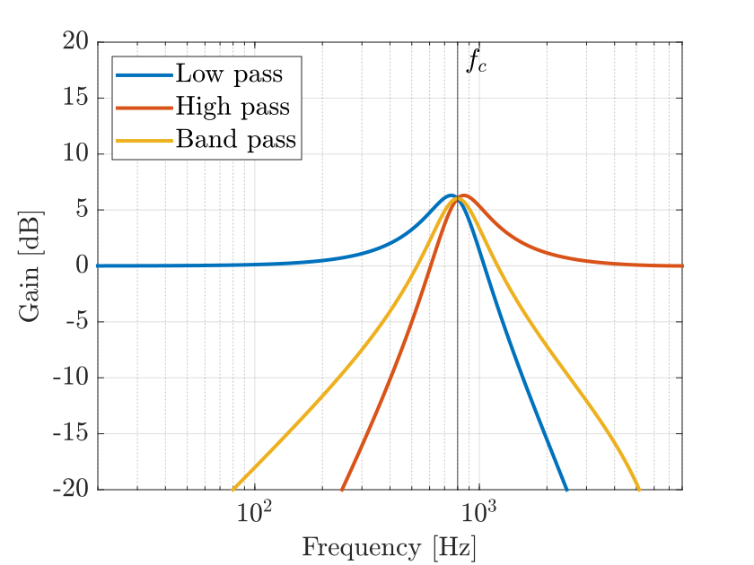
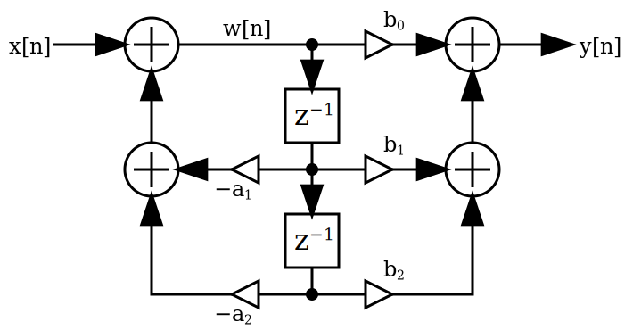
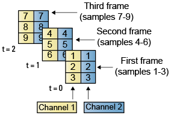
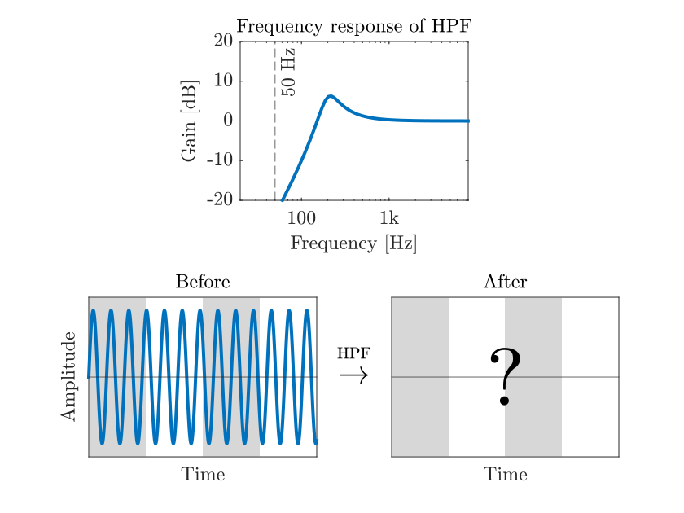

<!--
 _class: title
 -->
# MATLAB で Audio Plugin 開発
## #02 イコライザ
松本 和樹 (早稲田大学，MATLAB Student Ambassador)

---

<!--
 _class: title
 -->
 
# はじめに

---

# 自己紹介

<div style="display: flex; align-items: center; align-items: flex-start;">

<div style="flex: 2;padding-right: 200px"> 


<div class="figure-caption"> 

</div>

</div> 

<div style="flex: 5;">

**氏名**　：松本 和樹
**研究**　：音響信号処理
**趣味**　：作曲
**仕事**　：**MATLAB Student Ambassador**
　　　　[@km_MATLAB_Amb](https://twitter.com/km_MATLAB_Amb)
</div>
</div> 

---

# MATLAB で Audio Plugin 開発

## Audio Plugin とは
- DAW 等の**音楽制作ソフトウェア**上で動作する拡張機能
- MATLAB の [Audio Toolbox](https://jp.mathworks.com/products/audio.html) で手軽な開発が可能


## シリーズの内容
- [第1回：ゲイン (＋プラグインの作りの基礎)](AudioPlugin_01_Gain.html)
- [第2回：イコライザ](AudioPlugin_02_EQ.html)
- [第3回：ディストーション](AudioPlugin_03_Distortion.html)

プログラムは：https://github.com/kzkmtmt/audioPlugins からダウンロード


---

<!--
 _class: title
 -->

# イコライザ

---

# イコライザとは

<div style="display: flex; align-items: center; align-items: flex-start;">

<div style="flex: 1;padding-right: 80px;"> 

<div class="figure-caption"> 

今回扱うフィルタ

</div>

</div> 

<div style="flex: 1.5;">

- **周波数帯域ごとの音量**を整えるツール
- 信号処理的には**線形フィルタ**と呼ばれる
- 今回は三種類のフィルタを実装

<table class="marpit">
  <colgroup>
    <col style="width: 25%;">
    <col style="width: 75%;">
  </colgroup>
  <thead>
    <th>種類</th>
    <th>効果</th>
  </thead>
  <tr>
    <td><b style="color:#0072BD">Low Pass</td>
    <td>低域を通過（ハイカット）</td>
  </tr>
  <tr>
    <td><b style="color:#D95319">High Pass</td>
    <td>高域を通過（ローカット）</td>
  </tr>
  <tr>
    <td><b style="color:#EDB120">Band Pass</td>
    <td> カットオフ周波数を中心とした<br>帯域を通過</td>
  </tr>
</table>

</div> 
</div> 

---

# 双二次フィルタ
<div style="display: flex; align-items: center; align-items: flex-start;">

<div style="flex: 1;padding-right: 80px;"> 


<div style="margin-top:40;margin-bottom:40" class="shadowed-img">

<div style="padding-top:30pt; padding-bottom:20pt">


$$
\begin{aligned}
\begin{equation}
         H(z) = \frac{b_0 + b_1z^{-1}+b_2z^{-2}}{a_0 + a_1z^{-1}+a_2z^{-2}}
       \end{equation}
      \\
\end{aligned}

$$

</div>
</div>


<div class="figure-caption"> 
双二次フィルタ（上）とその伝達関数（下）

</div>


> 画像：https://en.wikipedia.org/wiki/File:Biquad_filter_DF-IIx.svg

</div> 

<div style="flex: 1.5;">

- イコライザでは**双二次フィルタ (biquad filter)** を
    用いることが多い
- **IIR (Infinite Impulse Response)** フィルタの一種
- 分子係数 $b_0,~b_1,~b_2$，分母係数 $a_1,~a_2$ の設定により
様々なフィルタを実現できる

| 要素| 記号 | 働き |
| - | - | - |
| <div style="text-align: center;">加算器 |  <div style="text-align: center;">$\Large\bigcirc\!\!\!\!\!\!\phantom{\tiny\overset{\,\,}{}}\Large+$</div> | <div style="text-align: center;">信号を加算 |
| <div style="text-align: center;">乗算器 | <div style="text-align: center;">$\Large-\!\!\!\tiny\,\,\,\Large	\triangleright^{\normalsize \underset{}{\!\!a}}\tiny\!\!\!\!\!\!\!\!\Large-$</div> | <div style="text-align: center;">信号を $a$ 倍　|
| <div style="text-align: center;"> 遅延器| <div style="text-align: center;">$\Large\overset{\huge-\!\normalsize\overset{\large\blacktriangleright}{\phantom{.}}}{}\tiny\!\!\overset{\tiny\quad}{\huge\Box}\tiny\!\!\!\!\!\!\!\!\!\!\!\!\!\!\!\!\normalsize{\overset{z^{-1}}{\vphantom{\tiny v}}{\tiny}}\Large\overset{\huge-}{}$</div>| <div style="text-align: center;">1 サンプル遅延|


</div> 


</div> 


---


# Low Pass Filter の係数の計算式


<div style="display: flex; align-items: center; align-items: flex-start;">

<div style="flex: 1;padding-right: 80px;"> 

## 式（双一次変換を用いて導出）

<div>

<div  class="shadowed-img" style="display: flex; align-items: center; align-items: flex-start; padding-top:30pt; padding-bottom:20pt">

<div style="flex: 1;"> 

$$
\left\{\quad
  \begin{aligned}
  b_0 &= \frac{1-\cos\omega_c}{2}\\
  b_1 &= 1-\cos\omega_c\\
  b_2 &= \frac{1-\cos\omega_c}{2}\\
  \end{aligned}
  \right.
  $$

</div style>
<div style="flex: 1;"> 

  $$
  
  \left\{\quad
  \begin{aligned}
  a_0 &= 1+\alpha\\
  a_1 &= -2\cos\omega_c\\
  a_2 &= 1-\alpha\\
  \end{aligned}
  \right.
  $$
</div>
</div>
</div>

<div style="margin-top: 20pt">


- $f_c$：カットオフ周波数，$Q$：レゾナンス
- $f_s$：サンプリング周波数
- $\omega_c = 2\pi f_c / f_s$，$\alpha = \sin \omega_c / 2 Q$
- 導出や他のフィルタについては
 [Audio EQ Cookbook](https://www.w3.org/TR/audio-eq-cookbook/) で確認
</div>

</div>


<div style="flex: 1;padding-left: 80px;"> 


## 実装


```MATLAB
fc    = 400; 
Q     = 2; 
fs    = 16000; 
w0    = 2*pi*fc/fs;
alpha = sin(w0)/(2*Q);
cosw0 = cos(w0);

% b = [b0 b1 b2], a = [a0 a1 a2]
b = [ (1-cosw0)/2,1-cosw0,(1-cosw0)/2]; 
a = [1+alpha,-2*cosw0,1-alpha];
```

</div>
</div>

---

# フィルタ特性の確認 / フィルタの適用

- ``freqz``：得られたフィルタ（分子係数 `b` と分母係数 `a` ）の特性を確認

  ```MATLAB
  [h,f]=freqz(b,a,[],fs);             % 周波数特性を計算．
  plot(f,mag2db(abs(h)),LineWidth=2); % 振幅特性（＝ h の絶対値を dB に変換したもの）をプロット
  ```

- ``filter``：信号にフィルタ（分子係数 `b` と分母係数 `a` ）を適用する

  ```MATLAB
  x = randn(fs*0.5,1); % 0.5 秒の雑音を生成
  y = filter(b,a,x);   % フィルタを適用
  soundsc(y,fs);       % 再生
  ```

---

<!--
 _class: title
 -->

# フレームベースの処理

---

# フレームベースの処理
<div style="display: flex; align-items: center; align-items: flex-start;">

<div style="flex: 0.5; padding-right: 80px;"> 
<div >

</div>
<div class="figure-caption"> 

フレームベース処理

</div>
</div>

<div style="flex: 1;padding-right: 80px;"> 

- 信号を**リアルタイム処理**したい
$\blacktriangleright$ ある程度の長さの**フレーム**に分割し，逐次的に処理

- フレームのつながりを意識した実装が必須

- イコライザの実装では，
**遅延器の状態**をフレーム間で伝搬する必要がある

</div>

</div>

> 画像：https://www.mathworks.com/help/dsp/ug/sample-and-frame-based-concepts.html

---

# フレームベースのフィルタの実装例


<div style="display: flex; align-items: center; align-items: flex-start;">

<div style="flex: 1;padding-right: 80px;"> 

<div class="figure-caption"> 

フレームベースのフィルタ適用例

</div>

</div> 

<div style="flex: 1.5;">

以下のようなケースを考える
- 50 Hz の正弦波（左下）に HPF（上）を適用
- サンプリング周波数は 16 kHz ，フレーム長は 1024 

```MATLAB
fs = 16000;
t  = (0:4095)'/fs;
x  = sin(2 * pi * 50 * t);
x1 = x(1:1024,:);
x2 = x(1025:2048,:);
x3 = x(2049:3072,:);
x4 = x(3073:4096,:);
```

</div> 
</div> 

---

# フレームベースのフィルタの実装例

<div style="display: flex; align-items: center; align-items: flex-start;">

<div style="flex: 1;padding-right: 80px;"> 

<div class="figure-caption"> 

よくない実装の例（フレームの境界で不連続）

</div>

</div> 

<div style="flex: 1.5;">

**よくない実装の例**：`filter`を前から順に適用
  ```MATLAB

   y1    = filter(b,a,x1);   % 1 フレーム目
   y2    = filter(b,a,x2);   % 2 フレーム目
   y3    = filter(b,a,x3);   % 3 フレーム目
   y4    = filter(b,a,x4);   % 4 フレーム目
   y     = [y1;y2;y3;y4];    % 出力
  ```
  ❌ フレーム間で信号が途切れてしまう

</div> 
</div> 


---

# フレームベースのフィルタの実装例

<div style="display: flex; align-items: center; align-items: flex-start;">

<div style="flex: 1;padding-right: 80px;"> 

<div class="figure-caption"> 

適切な実装の例

</div>

</div> 

<div style="flex: 1.5;">

**適切な実装の例**　：遅延器の状態 `z`を伝搬
  ```MATLAB
      z  = zeros(2,1);       % 遅延器の状態の初期化
  [y1,z] = filter(b,a,x1,z); % 1 フレーム目
  [y2,z] = filter(b,a,x2,z); % 2 フレーム目
  [y3,z] = filter(b,a,x3,z); % 3 フレーム目
  [y4,z] = filter(b,a,x4,z); % 4 フレーム目
   y     = [y1;y2;y3;y4];    % 出力
  ```
  - `z` はフィルタ次数（遅延器の数）$\!\times$ チャネル数の行列
  - モノラルの双二次フィルタの場合は 2 $\times$ 1
</div> 
</div> 


---

<!--
 _class: title
 -->

# プラグインの実装

---

# フィルタ係数を計算する関数

## Low Pass Filter (`calcLPFCoeffs.m`)

```MATLAB
function [b,a] = calcLPFCoeffs(fc,fs,Q)
    wc    = 2*pi*fc/fs;
    alpha = sin(wc)/(2*Q);
    coswc = cos(wc);
    
    b = [ (1-coswc)/2,...
           1-coswc,   ...
          (1-coswc)/2]/(1+alpha);

    a = [1+alpha,...
         -2*coswc,...
         1-alpha]/(1+alpha);
end
```

---

# フィルタ係数を計算する関数

## High Pass Filter (`calcHPFCoeffs.m`)

```MATLAB
function [b,a] = calcHPFCoeffs(fc,fs,Q)
    wc    = 2*pi*fc/fs;
    alpha = sin(wc)/(2*Q);
    coswc = cos(wc);

    b = [ (1+coswc)/2,...
         -(1+coswc),...
          (1+coswc)/2]/(1+alpha);

    a = [1+alpha,...
         -2*coswc,...
         1-alpha]/(1+alpha);
end
```

---


# フィルタ係数を計算する関数

## Band Pass Filter (`calcBPFCoeffs.m`)

```MATLAB
function [b,a] = calcBPFCoeffs(fc,fs,Q)
    wc    = 2*pi*fc/fs;
    alpha = sin(wc)/(2*Q);
    cosw0 = cos(wc);

    b = [ Q*alpha,...
          0,...
         -Q*alpha];

    a = [1+alpha,...
         -2*cosw0,...
         1-alpha];
end
```

---

# プラグインのクラスを実装

## プロパティの定義（`MATLAB_EQ.m`から抜粋）

```MATLAB 
classdef MATLAB_EQ < audioPlugin

    properties
        fs                % サンプリング周波数
        fc   = 2000       % カットオフ周波数
        Q    = 1/sqrt(2)  % レゾナンス
        z    = zeros(2,2) % フィルタの遅延器の状態（2次 x 2ch）
        type = 'LowPass'; % フィルタの種類
    end
```

---

# プラグインのクラスを実装

## 操作画面の定義（1/2, `MATLAB_EQ.m`から抜粋）

```MATLAB 
properties(Constant)
    PluginInterface = ...
        audioPluginInterface( ...
        audioPluginParameter(...
        'type',...　　　　　　　　　　　　     % プロパティ名 type
        'DisplayName','Type',...　　　　　　  % Type
        'Mapping', {'enum','LowPass', ...
                            'HighPass', ...
                            'BandPass'} ...   % フィルタの種類
        ),...
```
---

# プラグインのクラスを実装

## 操作画面の定義（2/2, `MATLAB_EQ.m`から抜粋）

```MATLAB 
        audioPluginParameter(...
        'fc',...                             % プロパティ名 fc
        'DisplayName','Cutoff Frequency',... % 画面に表示する名前
        'Mapping',{'log',10,20000},...       % 対数的に，10 Hz から 20 kHz まで
        'Label','Hz'...                      % 単位は Hz
        ),...
        audioPluginParameter(...
        'Q',...                              % プロパティ名 Q
        'DisplayName','Resonance',...        % 画面に表示する名前
        'Mapping',{'log',0.025,20}...        % 対数的に 0.025 から, 40 まで
        )...
        );
end
```

---

# プラグインのクラスを実装

## フィルタ処理を実装（`MATLAB_EQ.m`から抜粋）

```MATLAB 
function y = process(p,x)
    p.fs  = getSampleRate(p); % サンプリング周波数の取得

    switch p.type % フィルタ係数の計算
        case 'LowPass'
            [b,a] = calcLPFCoeffs(p.fc,p.fs,p.Q);
        case 'HighPass'
            [b,a] = calcHPFCoeffs(p.fc,p.fs,p.Q);
        otherwise
            [b,a] = calcBPFCoeffs(p.fc,p.fs,p.Q);
    end

    [y,p.z] = filter(b,a,x,p.z);  % フィルタの適用
end
```

---


<!--
 _class: title
 -->

# おわりに

---

# まとめ
<div style="margin-top:-20px; margin-bottom:20px">

- イコライザ（フィルタ）の実装
- フレームベースの処理
</div>

# Further Practice

<div style="margin-top:-20px; margin-bottom:20px">

- [Audio EQ Cookbook](https://www.w3.org/TR/audio-eq-cookbook/) に記載されている他の種類のフィルタを実装してみる
</div>

# 役立つ資料

<div style="margin-top:-20px; margin-bottom:20px">

- [Audio EQ Cookbook](https://www.w3.org/TR/audio-eq-cookbook/) ：イコライザで用いられるフィルタの導出
- [やる夫で学ぶディジタル信号処理](http://www.ic.is.tohoku.ac.jp/~swk/lecture/yaruodsp/main.html)：信号処理全般

</div>
