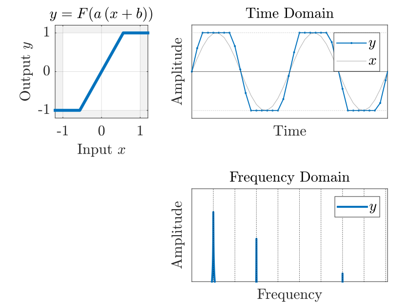

<!--
 _class: title
 -->
# MATLAB で Audio Plugin 開発
## #03 ディストーション
松本 和樹 (早稲田大学，MATLAB Student Ambassador)

---
<!--
_class: title
-->

# はじめに

---

# 自己紹介

<div style="display: flex; align-items: center; align-items: flex-start;">

<div style="flex: 2;padding-right: 200px"> 


<div class="figure-caption"> 

</div>

</div> 

<div style="flex: 5;">

**氏名**　：松本 和樹
**所属**　：早稲田大学
**研究**　：音響信号処理
**趣味**　：作曲
**仕事**　：**MATLAB Student Ambassador**
　　　　[@km_MATLAB_Amb](https://twitter.com/km_MATLAB_Amb)
</div>
</div> 

---

# MATLAB で Audio Plugin 開発

## Audio Plugin とは
- DAW 等の**音楽制作ソフトウェア**上で動作する拡張機能
- MATLAB の [Audio Toolbox](https://jp.mathworks.com/products/audio.html) で手軽な開発が可能


## シリーズの内容
- [第1回：ゲイン (＋プラグインの作りの基礎)](AudioPlugin_01_Gain.html)
- [第2回：イコライザ](AudioPlugin_02_EQ.html)
- [第3回：ディストーション](AudioPlugin_03_Distortion.html)

プログラムは：https://github.com/kzkmtmt/audioPlugins からダウンロード


---

<!--
_class: title
-->

# ディストーション

---

# ディストーションとは

<div style="display: flex; align-items: center; align-items: flex-start;">

<div style="flex: 1;padding-right: 80px;"> 

<div class="figure-caption"> 

ディストーションの効果：`preGain =  5`

</div>

</div> 

<div style="flex: 1.5;">

- 音を**歪ませる**エフェクタ

    - エレキギター
    - 音割れ
- 歪みによって**倍音**が付加される

</div> 
</div> 

---
# ディストーションの仕組み


<div style="display: flex; align-items: center; align-items: flex-start;">

<div style="flex: 1;padding-right: 80px;"> 


<div class="figure-caption"> 

ディストーションの効果：`preGain =  5`

</div>

</div> 

<div style="flex: 1.5;">


## 基本的な仕組みは単純

- 関数 $F$ を入力信号 $x(t)$ に適用

- 関数 $F$ 適用前に定常成分（定数 $b$）の加算 & 
    振幅を増幅（定数 $a$ 倍）することで歪みを調整
    
    $$
    y(t) = F(a\,(x(t)+b))
    $$

- Hardclipper が典型例：**好みの関数を見つけよう！**
    $$
    \begin{aligned}
    F_\text{Hardclip}(x) &= \left\{\matrix{1 & (x > 1) \cr x & (-1\leq x \leq 1) \cr -1 & (x < -1) }\right.\\
    &= \min(\max(x,-1),1)
    \end{aligned}
    $$


</div>
</div> 

---
# ディストーションの実装
<div style="display: flex; align-items: center; align-items: flex-start;">
<div style="flex: 1; ; padding-right: 80px"> 


<div class="figure-caption"> 

ディストーションの効果：`preGain =  5`
</div>
</div> 
<div style="flex: 1.5;">

## 実装
```matlab
F = @(x) min(max(x,-1),1);  % ハードクリッピングの関数

y = F(a.*(x + b));          % ディストーションの適用
```
✅ 元信号の周波数の整数倍の成分（＝倍音）が現れた！

<br>

※ `@` は無名関数を作るための記号

</div>
</div> 

---
# ディストーションの実装
<div style="display: flex; align-items: center; align-items: flex-start;">
<div style="flex: 1; ; padding-right: 80px"> 


<div class="figure-caption"> 

ディストーションの効果：`preGain = 25`
</div>

</div> 

<div style="flex: 1.5;">

## 実装
```matlab
F = @(x) min(max(x,-1),1);  % ハードクリッピングの関数

y = F(a.*(x + b));          % ディストーシ
```
しかし，ゲインをあげてみると？
- ザラザラした音がする🤔
- スペクトルを確認 $\blacktriangleright$ 整数次の倍音（点線）だけでなく
    **非整数次の倍音**まで現れている🤔
</div>
</div> 

---
<!--
_class: title
-->

# サンプリング定理とオーバーサンプリング

---
# サンプリング定理
<div style="display: flex; align-items: center; align-items: flex-start;">
<div style="flex: 1; "> 

<video class="shadowed-img" src="./assets/images/03/sampling_theorem_visualization.mp4" loop muted controls autoplay></video>

<div class="figure-caption"> 

サンプリング定理の直観的理解
</div>

</div> 

<div style="flex: 1.5; padding-left: 80px">

**離散時間信号で扱える帯域幅には限りがある**

- 音響信号は音波を一定間隔でサンプリングしたもの
- **サンプリング周波数** $f_s$：一秒あたりのサンプル数
- <span class="orange-text">**橙**</span>がナイキスト周波数 $f_N = (f_s/ 2)$ 超えると，
    $0$ ~ $f_N$ の範囲に存在する別の正弦波（<span class="blue-text">**青**</span>）と
    区別がつかない

- <span class="orange-text">**橙**</span>をサンプリングしたにもかかわらず，
    周波数が折り返された別の音（<span class="blue-text">**青**</span>）として再生される
    $\blacktriangleright$**エイリアシング**と呼ばれる現象

- エイリアシングにより生じる雑音を**エイリアスノイズ（折り返し雑音）** と呼ぶ

</div>
</div> 

---

# ディストーションは高周波数成分を生む
<div style="display: flex; align-items: center; align-items: flex-start;">
<div style="flex: 1; "> 

<video class="shadowed-img" src="./assets/images/03/square.mp4" loop muted controls autoplay></video>

<div class="figure-caption"> 

矩形波のフーリエ級数展開
</div>


</div> 

<div style="flex: 1.5; padding-left: 80px">

- 以下のようなディストーションを考える
    $$
    F(x) = \left\{\matrix{1 & (x \geq 0) \cr -1 & (x < 0) }\right.
    $$
    この関数は正弦波から**矩形波** $y_\mathrm{square}(t)$ を生む

- 矩形波を正弦波の和に分解（**フーリエ級数展開**）
    $\blacktriangleright$**無限に高い周波数の成分**が含まれている

    $$
    y_\mathrm{square}(t) = \frac{4}{\pi}\sum_{k=1}^\infty \frac{\sin(2\pi (2k+1)t)}{2k+1}
    $$

- ディストーション適用後の波形は**帯域幅が無限大**
    $\blacktriangleright$**エイリアシングが発生してしまう**

</div>
</div> 

---

# アンチエイリアシング
<div style="display: flex; align-items: center; align-items: flex-start;">
<div style="flex: 1; "> 

<video class="shadowed-img" src="./assets/images/03/anti_aliasing_visualization.mp4" 
poster="./assets/images/03/anti_aliasing_visualization_poster.svg" loop muted controls autoplay></video>

<div class="figure-caption"> 

矩形波に対するアンチエイリアシング
</div>


</div> 

<div style="flex: 1.5; padding-left: 80px">

- **アンチエイリアシング**：
  サンプリングの前にナイキスト周波数 $f_N$ よりも高い周波数の成分を取り除く（＝**帯域幅を制限する**）ことでエイリアシングを防止

- 理想的に帯域制限された矩形波は，矩形波のフーリエ級数展開を有限の $k$ で打ち切ったものに対応する
    $$
    \frac{4}{\pi}\sum_{k=1}^K \frac{\sin(2\pi (2k+1)t)}{2k+1}
    $$

</div>
</div> 

---

# オーバーサンプリング
<div style="display: flex; align-items: center; align-items: flex-start;">
<div style="flex: 1; "> 


<div class="figure-caption"> 

オーバーサンプリングを用いるディストーション
</div>


</div> 

<div style="flex: 1.5; padding-left: 80px">

エイリアスノイズの発生を抑制するには
**オーバーサンプリング**が有効

<br>

1. サンプリング周波数を $M$ 倍に引き上げる

1. ディストーションの関数 $F$ を適用

1. **アンチエイリアシングフィルタ（AAF）** を適用し，
    ナイキスト周波数 $f_N$ 以下の成分を除去

1. サンプリング周波数をもとに戻す

<br>

$\blacktriangleright$ 帯域制限された矩形波に近い結果が得られる

</div>
</div> 

---


# オーバーサンプリング
<div style="display: flex; align-items: center; align-items: flex-start;">
<div style="flex: 1; "> 


<div class="figure-caption"> 

オーバーサンプリングを用いるディストーション
</div>


</div> 

<div style="flex: 1.5; padding-left: 80px">

## 高音質な実装

実装上は `interp` や `decimate` を利用
アンチエイリアシングフィルタの適用が実装されている

```MATLAB
M  = 8;              % オーバーサンプリングの次数
x2 = interp(x,M);    % アップサンプリング
y2 = f(a.*(x2 + b)); % ディストーションの適用
y  = decimate(y2,M); % ダウンサンプリング
```

</div>
</div> 


---


# オーバーサンプリング

<div style="display: flex; align-items: center; align-items: flex-start;">
<div style="flex: 1; margin-right:20px"> 


<div class="figure-caption"> 

オーバーサンプリングなし
</div>


</div> 

<div style="flex: 1; margin-left:20px"> 


<div class="figure-caption"> 
オーバーサンプリングあり
</div>

---

<!--
 _class: title
 -->

# プラグインの実装

---

<!--
 _class: title
 -->

# おわりに

---

# まとめ

- ディストーション
- サンプリング定理
- オーバーサンプリングによるエイリアスノイズの低減

# Further Practice

- 関数 $F$ をいじってより面白い歪みを探求する


# 役立つ資料

- [やる夫で学ぶディジタル信号処理](http://www.ic.is.tohoku.ac.jp/~swk/lecture/yaruodsp/main.html)：信号処理全般

